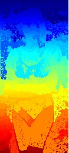
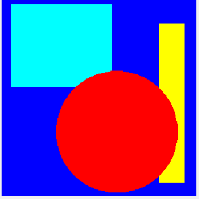

#  Image Segmentation: Region Growing

# Table of contents
1. [Introduction](#introduction)

2. [Four Neighborhood Connectivity](#4-connectivity)
    - [Gray Scale Images](#4-GS-images)
        - [Coins Image](#4-coins-image)
        - [MedTest Image](#4-medtest-image)
    - [RGB Images](#4-RGB-images)
        - [Color Image](#4-color-image)
        - [Gantry-Crane Image](#4-gantrycrane-image)
        - [Woman Image](#4-woman-image)

3. [Egiht Neighborhood Connectivity](#8-connectivity)
    - [Gray Scale Images](#8-GS-images)
        - [Coins Image](#8-coins-image)
        - [MedTest Image](#8-medtest-image)
    - [RGB Images](#8-RGB-images)
        - [Color Image](#8-color-image)
        - [Gantry-Crane Image](#8-gantrycrane-image)
        - [Woman Image](#8-woman-image)

4. [Conclusion](#conclusion)
---

## **Introduction** 
The goal of this tutorial is to investigate the effectiveness of the region growing (RG) algorithm for 
image segmentation. We'll apply the RG algorithm to 2D and 3D images.

## **Four Neighborhood Connectivity** 
First we started with 4-Neighborhood kernel. This Section is divided into two parts; first Gray Scale Images, then Colored (RGB) Images.

### **Gray Scale Images** 
For Grayscale images, we tested Coins, and Medtest images. Let's see results.

#### **Coins Image** 
| Result |  |  |  |
|----------|:-------------:|:-------------:| :-------------:|
| **Threshold** | 10 | 15 | 20 |
| **Time (seconds)** | 1.52 | 1.57 | 1.71 
| **Comment** | Bad result, because it doesn't separate foreground and background efficienntly | Also still bad result | Good result as it segmented foreground and background |
---

&nbsp;
| Result |  |  |  |
|----------|:-------------:|:-------------:| :-------------:|
| **Threshold** | 25 | 30 | 35 |
| **Time (seconds)** | 1.76 | 1.6 | 1.61
| **Comment** | Also, this is a good result | top coins started to disappear (be like the background) | top coins started to disappear (be like the background) |
---
> **Best threshold is 20** as it segmented the coins from background without overfitting. Also good in execution time compared to another results and their execution time.

&nbsp;
#### **MedTest Image** 
| Result |  |  |  |
|----------|:-------------:|:-------------:| :-------------:|
| **Threshold** | 5 | 15 | 20 |
| **Time (seconds)** | 45.9 | 49.69 | 50.57 
| **Comment** | Bad results, because we didn't see the inner details  | results starts to be good | It's nearly a fine result as we see inner details |
---

&nbsp;
| Result |  |  |  |
|----------|:-------------:|:-------------:| :-------------:|
| **Threshold** | 25 | 30 | 35 |
| **Time (seconds)** | 52.38 |  51.68 | 53.31 |
| **Comment** | It's nearly a fine result as we see inner details in addition to it's separated foreground from the background  | foreground starts to take same pixel values of background  | upper part of image disappeared (take same values as background)  |
---
> Overall, **Thresholds 20, 25** got the best results as they segmented foreground and background without vanishing the inner details. Also, they are almost best results compared to execution time.

&nbsp;
### **RGB Images** 
For RGB images, we tested color, woman, and gantrycrane images. Let's see results.
#### **Color Image** 
| Result |  |  |  |
|----------|:-------------:|:-------------:| :-------------:|
| **Threshold** | 10 | 15 | 20 |
| **Time (seconds)** | 2.13 | 2.15 | 2.128
---
> As we increased the threshold, we got the same result as 3 colors are segmented successfuly and efficiently

&nbsp;

#### **Gantry-Crane Image** 
| Result |  |  |  |
|----------|:-------------:|:-------------:| :-------------:|
| **Threshold** | 10 | 20 | 30 |
| **Time (seconds)** | 2.9 | 3.2 | 3.31
| **Comment** |  |  |  |
---
&nbsp;

| Result |  |  |  |
|----------|:-------------:|:-------------:| :-------------:|
| **Threshold** | 40 | 50 | 80 |
| **Time (seconds)** | 3.34 | 3.39 | 3.31
| **Comment** |  |  | | 
---
&nbsp;

#### **Woman Image** 
| Result |  |  |  |
|----------|:-------------:|:-------------:| :-------------:|
| **Threshold** | 10 | 15 | 25 |
| **Time (seconds)** | 0.52 | 0.56 | 0.56
| **Comment** | couldn't distingush between foreground and background | woman starts to appear but still a bad results | results started to be good |
---
&nbsp;

| Result |  |  |  |
|----------|:-------------:|:-------------:| :-------------:|
| **Threshold** | 30 | 40 | 50 |
| **Time (seconds)** | 0.6 | 0.57 | 0.59
| **Comment** | more fine result | It's nearly a fine result as we see inner details | It's nearly a fine result as we see edges of the foreground (woman) | more fine result
---
> **Threshold 50** got the best result as it's fine segmented the woman from the background without overfitting.

&nbsp;

<!--  -->
<!--  -->
## **Eight Neighborhood Connectivity** 
This Section is divided into two parts; first Gray Scale Images, then Colored (RGB) Images.

### **Gray Scale Images** 
For Grayscale images, we tested Coins, and Medtest images. Let's see results.

#### **Coins Image** 
| Result |  |  |  |
|----------|:-------------:|:-------------:| :-------------:|
| **Threshold** | 10 | 15 | 20 |
| **Time (seconds)** | 1.66 | 1.51 | 1.52
---

&nbsp;
| Result |  |  |  |
|----------|:-------------:|:-------------:| :-------------:|
| **Threshold** | 25 | 30 | 35 |
| **Time (seconds)** | 1.52 | 1.56 | 1.58
---
> **Best threshold is 25** as it segmented the coins from background without overfitting. Also good in execution time compared to another results and their execution time.

&nbsp;
#### **MedTest Image** 
| Result |  |  |  |
|----------|:-------------:|:-------------:| :-------------:|
| **Threshold** | 5 | 15 | 20 |
| **Time (seconds)** | 46.99 | 50.85 | 51.30 
---

&nbsp;
| Result |  |  |  |
|----------|:-------------:|:-------------:| :-------------:|
| **Threshold** | 30 | 35 | 40 |
| **Time (seconds)** | 53.99 |  53.00 | 53.18 |
---
> **Threshold 20** got the best results as they segmented foreground and background without vanishing the inner details. Also, they are almost best results compared to execution time.

&nbsp;

### **RGB Images** 
For RGB images, we tested color, woman, and gantrycrane images. Let's see results.

#### **Color Image** 
As we can see there is no much difference when we increased the threshold so it won't make anysense to increase threshhold 
&nbsp;
| Result |  |  |  |
|----------|:-------------:|:-------------:| :-------------:|
| **Threshold** | 5 | 25 | 40 |
---
>So we can say threshold = 5 is great enough

#### **Gantry-Crane Image** 
This is a sub sub paragraph 2, formatted in heading 3 style 
&nbsp;
| Result |  |  |  |
|----------|:-------------:|:-------------:| :-------------:|
| **Threshold** | 5 | 10 | 25 |

&nbsp;
| Result |  |  |  |
|----------|:-------------:|:-------------:| :-------------:|
| **Threshold** | 45 | 62 |

---
>**Threshold 25** got the best results as the bigger threshold started overfitting and removing some details in the bridge.

#### **Woman Image** 
This is a sub sub paragraph 3, formatted in heading 3 style

&nbsp;
| Result |  |  |  |
|----------|:-------------:|:-------------:| :-------------:|
| **Threshold** | 10 | 20 | 30 |

&nbsp;
| Result |  |  |  |
|----------|:-------------:|:-------------:| :-------------:|
| **Threshold** | 40 | 45 |
---
> Overall, **Threshold 40** got the best results since smaller threshold couldn't complelty segement the background, and the  higher thresholds overfitted some details from the woman's body like her hands

&nbsp;
## **Conclusion** 
- As we discussed, each image has its own best threshold based on its details and its background, foreground pixel values.
- We tested the Segmentation Algorithm with two different Algorithms 8-Neighborhood Kernel, and 4-Neighborhood Kernel and 8-Neighborhood was faster than 4-neighborhood for all images